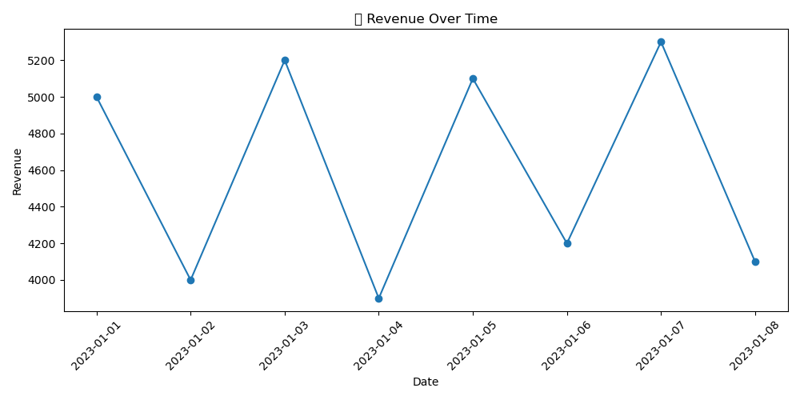
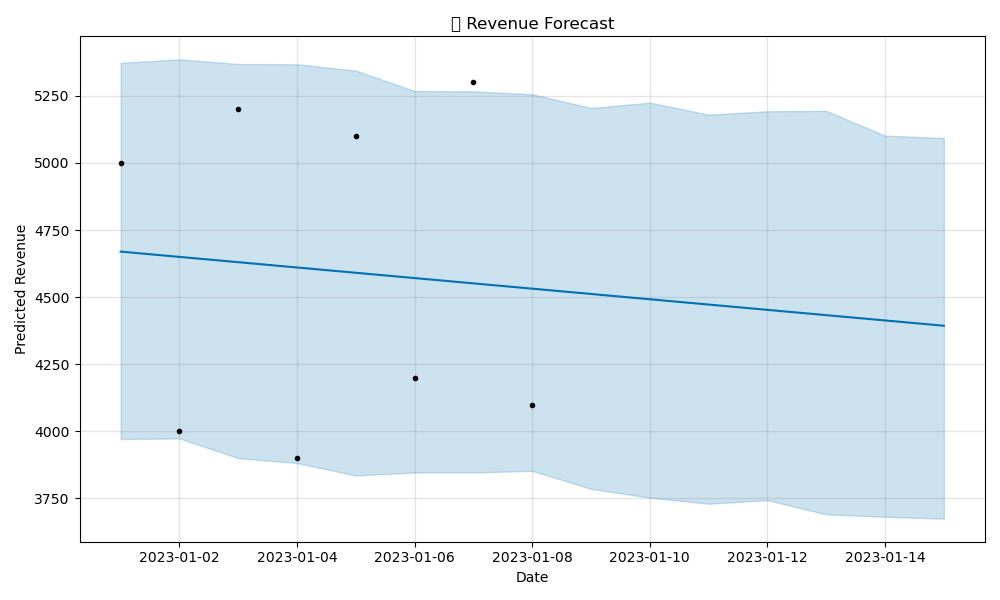
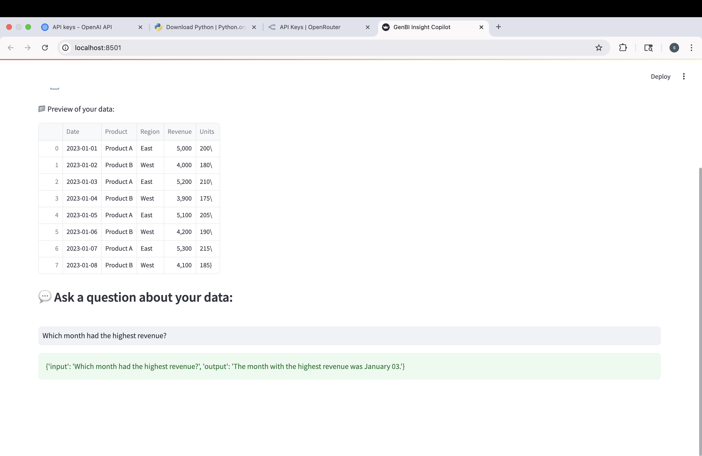
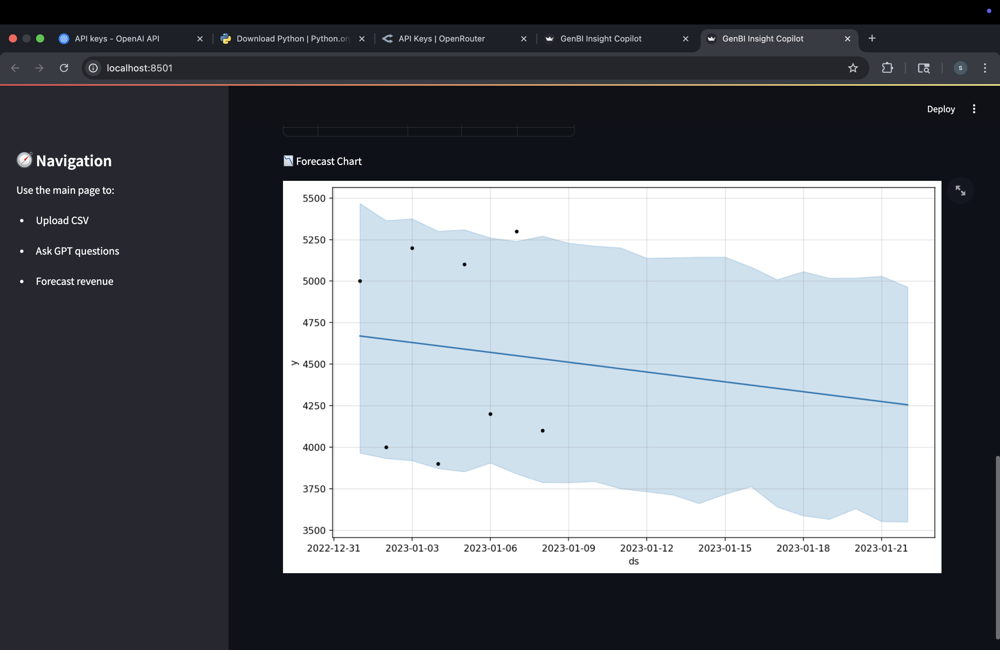
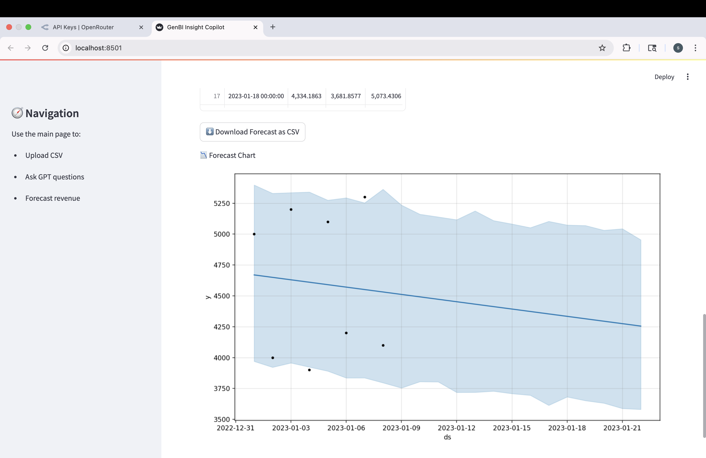
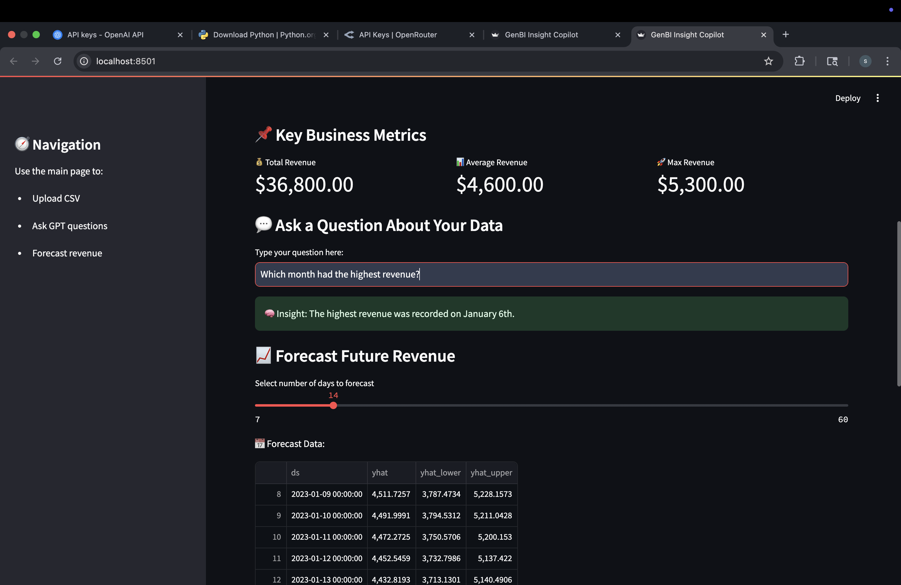

# 📊 GenBI Insight Copilot

**GenBI Insight Copilot** is an AI-powered business intelligence assistant built using Streamlit, LangChain, and LLMs. It allows users to upload CSV files, explore data using natural language, and forecast revenue trends using Prophet.

---

## 🚀 Features

- 📁 Upload CSV files for analysis
- 💬 Ask natural language questions about your data
- 🔍 Get instant AI-powered insights using LLMs
- 📈 Forecast future revenue trends with Prophet
- 🖼️ Visualize data and forecasts interactively using Streamlit
- ✅ Error handling for invalid questions or data issues

---

## 🧑‍💻 Technologies Used

- Python 3.10
- Streamlit
- LangChain
- OpenRouter (LLM API)
- Prophet (for time series forecasting)
- Pandas & Matplotlib

---

## ⚙️ Setup Instructions

1. Clone the repository:
   ```bash
   git clone https://github.com/muskusi/genbi_insight_copilot.git
   cd genbi_insight_copilot

2. Create and activate a virtual environment:
 ```bash
   python3 -m venv venv
source venv/bin/activate
```

### 3. Install dependencies

```bash
pip install -r requirements.txt
```


###  4. Create a .env file and add your OpenRouter API key
```bash
OPENAI_API_KEY="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"
```

###  5. Run the app
```bash
streamlit run streamlit_app.py
```
## 💬 Example Questions to Ask the Copilot

- What is the average revenue?
- Show me total sales by month.
- What was the highest revenue day?
- Forecast revenue for the next 30 days.
- What are the top 5 selling products?

---

## 🔐 Notes on LLM Setup & API Key

- This project uses OpenRouter to interact with models like Mistral 7B.
- Replace the placeholder key with your own valid OpenRouter API key in the `.env` file.
- The key is securely loaded using the `python-dotenv` package.
- Visit [OpenRouter.ai](https://openrouter.ai) to get your free API key.

---
## 🖼️ Screenshots

Here’s a quick look at the GenBI Insight Copilot in action:

### 📊 Revenue Over Time (Screenshot 1)  
Line chart showing revenue trends across dates.  


### 📈 Revenue Forecast Output (Screenshot 2)  
Forecast visualization using Prophet with uncertainty intervals.  


### 🧾 Data Preview & GPT Response (Screenshot 3)  
Table preview of uploaded CSV and LLM answering user question.  


### 🌙 Dark Theme Forecast Interface (Screenshot 4)  
Forecast chart displayed on a dark-themed UI.  


### 🌤️ Light Theme Forecast Interface (Screenshot 5)  
Forecast chart displayed in light mode with CSV download option.  


### 📌 Business Metrics & Forecast Dashboard (Screenshot 6)  
Comprehensive dashboard with KPIs, GPT question box, and forecast slider.  


## 👤 Author

**Samskruthi Musku**  
Data Analyst

🔗 [LinkedIn](https://www.linkedin.com/in/samskruthi-musku/) 
  
📎 [Portfolio](https://samskruthireddy088.wixsite.com/my-site-2)
